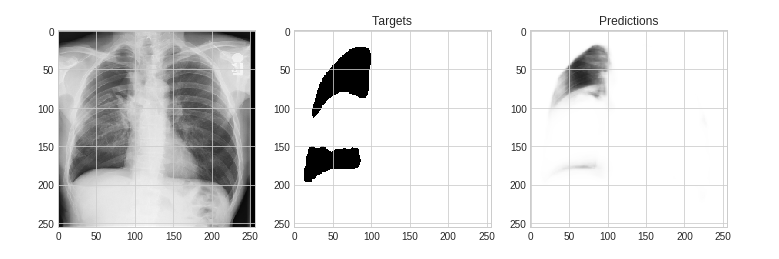

# SIIM-ACR Pneumothorax Segmentation


## 📋 Competition Overview

Kaggle competition to identify pneumothorax disease on chest X-rays and, if present, segment it.

- The dataset consists of chest X-ray images (DICOM format) and segmentation masks (RLE-encoded), provided via Google Healthcare Cloud.
- [Kaggle Competition Page](https://www.kaggle.com/competitions/siim-acr-pneumothorax-segmentation)
- Dates participated: **[Fill in]**

## 🏅 Awards

- **Bronze Medal** recipient (Top 10% solution on Kaggle)
- **Final Placement:** 127th out of 1,475 teams

## 🛠️ Project Structure

```
.
├── data/               # (not uploaded) Instructions for getting data
├── img/                # Project images (headers, sample predictions, etc.)
├── notebooks/          # Jupyter notebooks for EDA & model development
│   ├── SIIM_ACR_Pneumothorax_Competition_Data_Analysis.ipynb
│   ├── SIIM_pneumothorax_model.ipynb
│   └── unet-with-se-resnext50-32x4d-encoder-for-stage-2.ipynb
├── src/                # Python source code (data processing, model pipeline, logging)
│   ├── dataset.py
│   ├── losses.py
│   ├── model.py
│   ├── predict.py
│   ├── train.py
│   └── utils.py
├── logs/               # Log files
├── outputs/            # Model weights, predictions, submission files
├── tests/              # Unit and integration tests
│   ├── test_dataset.py
│   ├── test_losses.py
│   └── test_model.py
├── requirements.txt    # Python dependencies
├── pyproject.toml      # Tooling configs (ruff, bandit, etc.)
├── .pre-commit-config.yaml
└── README.md           # This file
```

## 🚀 Quickstart

1. **Clone this repo:**  
   ```
   git clone <repo-url>
   ```

2. **Download the competition data** from [Kaggle](https://www.kaggle.com/competitions/siim-acr-pneumothorax-segmentation/data) and place it in the `data/` folder.

3. **Install dependencies and tools:**  
   ```
   pip install -r requirements.txt
   pip install pre-commit
   pre-commit install
   ```

4. **Run code checks locally:**  
   - Lint: `ruff check src/`
   - Security: `bandit -r src/`
   - Tests: `pytest tests/`

5. **Run or explore the main notebooks in `notebooks/` for full end-to-end analysis and modeling pipeline.**

## 🧹 Code Quality & Security

- **Logging:** All scripts use the `logging` module for traceability.
- **Linting:** [ruff](https://github.com/astral-sh/ruff) for fast, consistent style.
- **Security:** [bandit](https://github.com/PyCQA/bandit) checks for common Python security issues.
- **Pre-commit:** Automated hooks for formatting, linting, and security on every commit.

## 📝 Approach & Solution

- **EDA:** See [SIIM_ACR_Pneumothorax_Competition_Data_Analysis.ipynb](notebooks/SIIM_ACR_Pneumothorax_Competition_Data_Analysis.ipynb) for clinical background and dataset analysis.
- **Modeling:** Deep learning model constructed using a ResNet34/SE-ResNeXt backbone with U-Net/UNet++ architecture. Trained on ~10,000 X-rays and corresponding masks.
- **Metric:** DICE coefficient, a common segmentation metric.
- **Validation:** Out-of-fold DICE, cross-validation reported in notebooks.
- **Submission:** Predictions on test set, RLE-encoded masks submitted to Kaggle.

## 🏅 Results

- **Best Public LB Score:** [Fill in]
- **Final Placement:** 127th out of 1,475 teams (Bronze Medal)
- **Public LB Rank (for reference):** 413/1050

## 📊 Visualizations

- Example chest X-ray, segmentation mask, and prediction:  
  

## 🤔 Lessons Learned

- Robust pre-processing and augmentation are vital for medical image segmentation.
- Combining strong encoders (ResNet, SE-ResNeXt) with U-Net delivers high performance on DICOM images.
- Modular pipelines and clear logging make experimentation and troubleshooting much smoother.

## 📃 References

- [Kaggle competition page](https://www.kaggle.com/competitions/siim-acr-pneumothorax-segmentation)
- [SIIM_ACR_Pneumothorax_Competition_Data_Analysis.ipynb](notebooks/SIIM_ACR_Pneumothorax_Competition_Data_Analysis.ipynb) by [Ekhtiar Syed](https://www.kaggle.com/ekhtiar)
- [Unet w/ SE Resnet50 32x4d encoder](notebooks/unet-with-se-resnext50-32x4d-encoder-for-stage-2.ipynb)

## 🙏 Acknowledgements

- Kaggle community kernels, SIIM & ACR, and the competition organizers.
